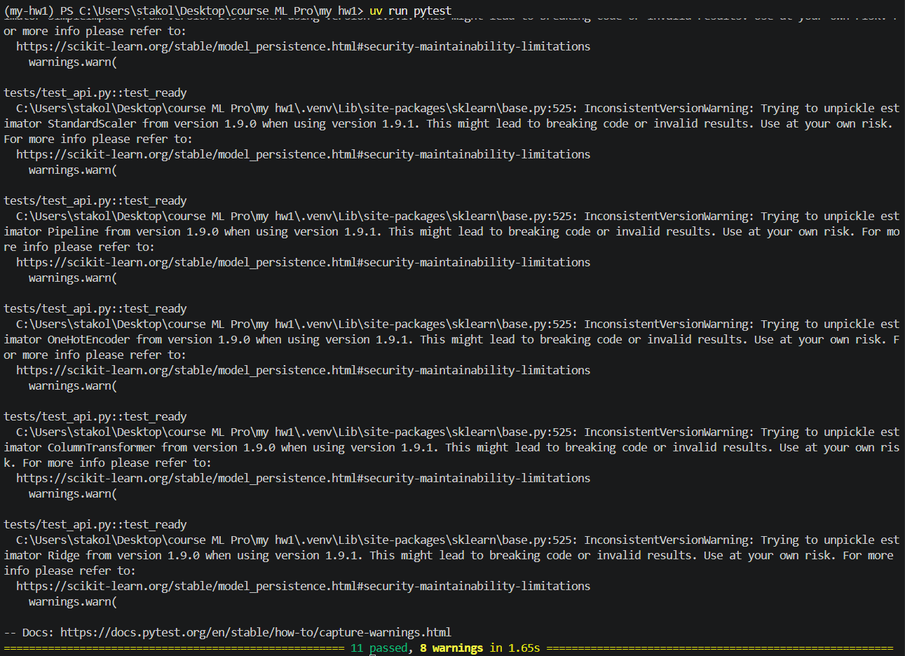
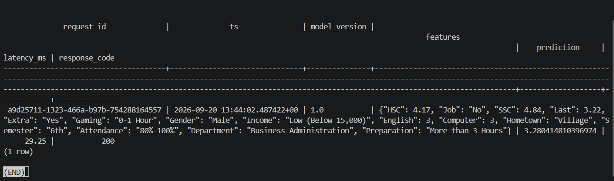
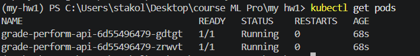
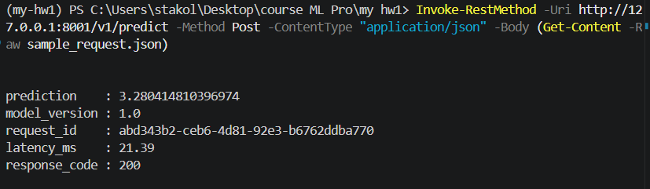
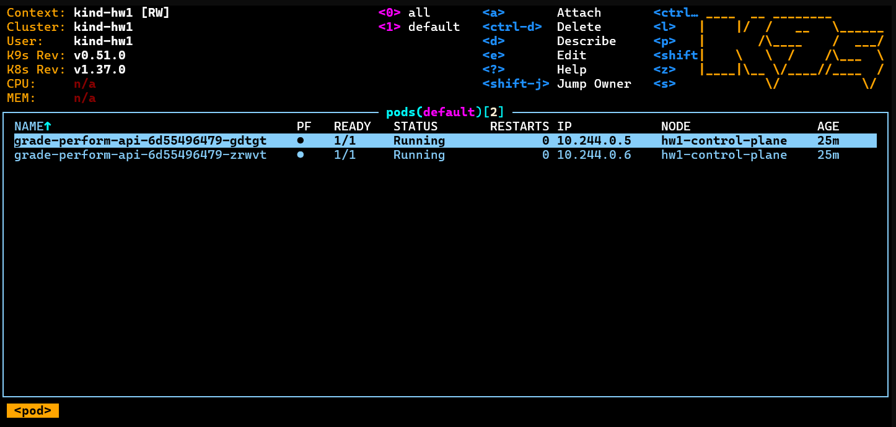
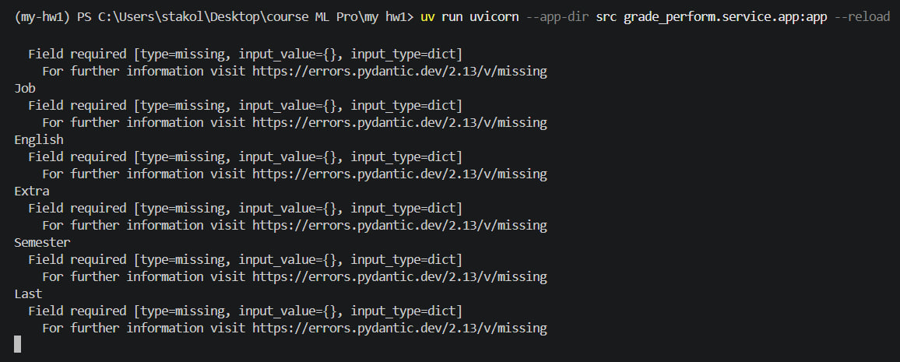
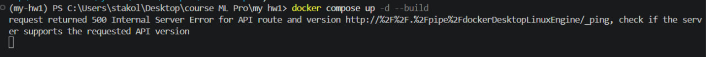
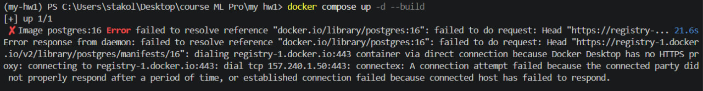
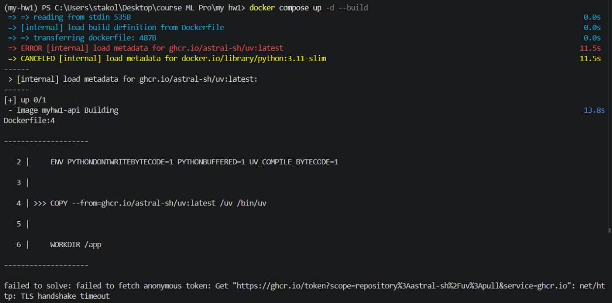
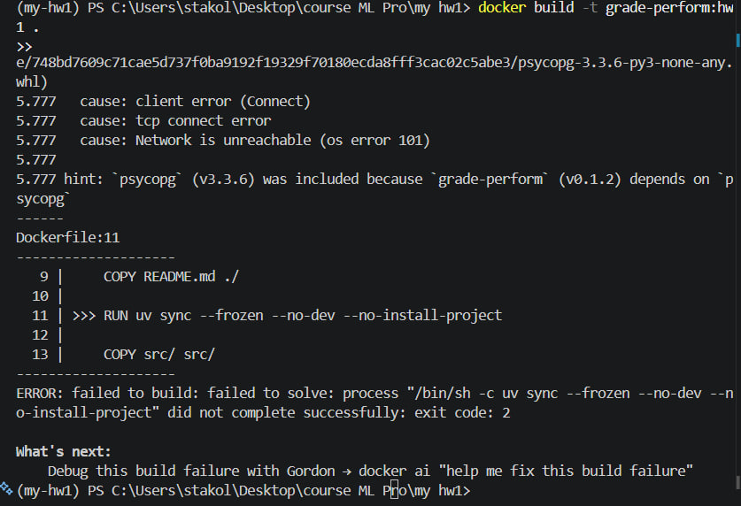

# grade_perform — ML-сервис предсказания успеваемости

FastAPI-сервис вокруг Ridge-регрессии (датасет ResearchInformation3, таргет `Overall`).

## Проверка — три команды сверху вниз

### 1. Тесты

```
uv sync
uv run pytest
```
### 2. Docker compose (api + Postgres, логи предсказаний)
```
docker compose up -d --build
Invoke-RestMethod -Uri http://localhost:8000/v1/predict -Method Post -ContentType "application/json" -Body (Get-Content -Raw sample_request.json)
docker compose exec db psql -U postgres -d grade_perform -c "SELECT * FROM predictions LIMIT 5;"
```

### 3. Kubernetes 

```
docker pull docker.m.daocloud.io/kindest/node:v1.37.0
kind create cluster --name hw1 --image docker.m.daocloud.io/kindest/node:v1.37.0
docker build -t grade-perform:hw1 .
kind load docker-image grade-perform:hw1 --name hw1
kubectl apply -f k8s/
kubectl rollout status deployment/grade-perform-api
kubectl get pods

kubectl port-forward service/grade-perform-api 8001:8000

В отдельном терминале:
Invoke-RestMethod -Uri http://127.0.0.1:8001/v1/predict -Method Post -ContentType "application/json" -Body (Get-Content -Raw sample_request.json)
```

## Скрины-доказательства

- терминал с выводом `uv run pytest`



- SELECT из таблицы логов (compose)



- `kubectl get pods` (2/2 Running) + ответ `/v1/predict` через port-forward




- k9s с подами (`:pods` или `:xray deploy`)




### Журнал проблем


-> Я создал экземпляр `features = Features()` в файле `features.py`, а затем выполнил импорт `from grade_perform.features import features` - ошибка, поэтому мне нужно импортировать только класс `Features` из `grade_perform.features`


-> Выключил впн


-> Попросил ИИ, исправление через `Set-DnsClientServerAddress -InterfaceAlias ​​"WLAN (Realtek WiFi)" -ServerAddresses 1.1.1.1,8.8.8.8`
`Clear-DnsClientCache`


-> Использовал команду `docker pull python:3.11-slim`


-> Очень долгая загрузка - сменить с COPY --from=ghcr.io/astral-sh/uv:latest /uv /bin/uv на COPY --from=ghcr.io/astral-sh/uv:latest /uv /bin/uv в dockerfile


-> положил COPY README ниже RUN