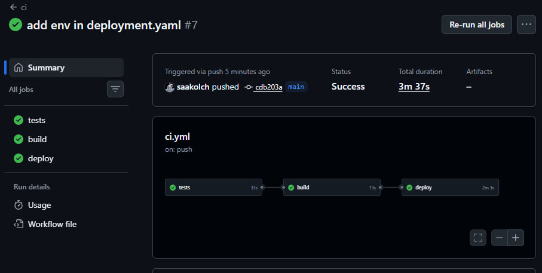
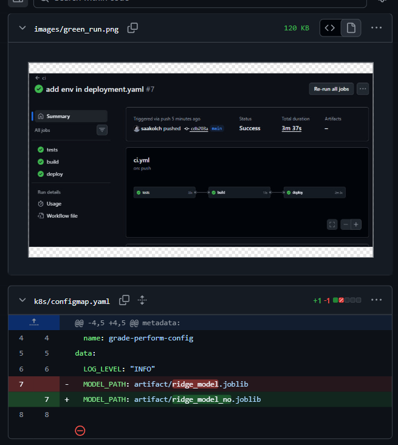

## Complete run

https://github.com/saakolch/ML_Pro_2026_assignment_1/pkgs/container/ml_pro_2026_assignment_1

## Branch with red and green tests

pull: https://github.com/saakolch/ML_Pro_2026_assignment_1/pull/1

## Changing model path in configMap

### Поменял ссылку, но ничего не сломалось, не очень понимаю почему, но думаю, что ссылка тащится из конфига 
