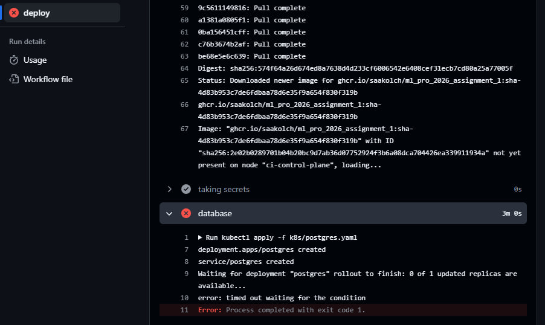

## Complete run

https://github.com/saakolch/ML_Pro_2026_assignment_1/pkgs/container/ml_pro_2026_assignment_1

## Branch with red and green tests

pull: https://github.com/saakolch/ML_Pro_2026_assignment_1/pull/1

## 2.3  Changing model path in configMap

### Поменял ссылку, но ничего не сломалось, не очень понимаю почему, но думаю, что ссылка тащится из конфига 

## 2.3 Broken secret 

red: https://github.com/saakolch/ML_Pro_2026_assignment_1/actions/runs/36326046542/job/108639065980
-> deploy is red, можно видеть через kubectl logs <pod-name>

green: https://github.com/saakolch/ML_Pro_2026_assignment_1/actions/runs/36326320274

## 2.3 Broken memory 

red: https://github.com/saakolch/ML_Pro_2026_assignment_1/actions/runs/36326492154
-> deploy красный

green: https://github.com/saakolch/ML_Pro_2026_assignment_1/actions/runs/36326546543

### Можно видеть через kubectl get pods для статуса, kubectl describe pod <pod-name> для шага диагностики, можно видеть само приложение через kubectl logs <pod-name>

### Questions
1. 3 мин 37 сек для первого:
https://github.com/saakolch/ML_Pro_2026_assignment_1/actions/runs/36322402594
2 мин 44 сек для второго
https://github.com/saakolch/ML_Pro_2026_assignment_1/actions/runs/36324012034 
Слой из докера взят для файлов зависимостей потому что зависимости одинковые для обоих веток

2. Поды в ImagePullBackOff создаются процессом RollingUpdate, который запускает новую версию приложения, не отключая старые работающие поды. Пайплайн остается зеленым, потому что команда kubectl apply проверяет только успешную отправку конфиг в кластер, а не фактический запуск контейнеров.

3. Пароль передается из GitHub Secrets в пайплайн, который создает объект Kubernetes Secret для безопасной подстановки в переменную окружения пода. Хранить его в ConfigMap нельзя из-за риска сливания данных при коммите в репозиторий.

4. Если убрать зависимость, сборка образа build запустится параллельно с тестами, и в случае падения тестов потрачу лишнее время на сборку заведомо сломанного кода.

5. За это отвечает строка on: pull_request с фильтром по конкретным джобам, а сделано это для экономии ресурсов CI/CD, чтобы не собирать образы и не обновлять сервера до одобрения кода.

6. Блокировка предотвращает состояние race condition при одновременном запуске двух реплик приложения, без нее они обе попытались бы одновременно применить миграции к пустой базе данных и вызвали бы ошибку дублирования структур.

7. Все красные прогоны в деплой, и ошибка с ссылкой на модель (которая у меня всё равно зеленая) это возможно ошибка будет старта, ошибка скачивания секретов для датабазы, ошибка выделения ресурсов будет на request с запросом памяти выше лимитов

## Errors

#### порт сменить с 8080:80 на 8080:8000, сервис сидит на 8000

#### не добавил пароль в сетинги

